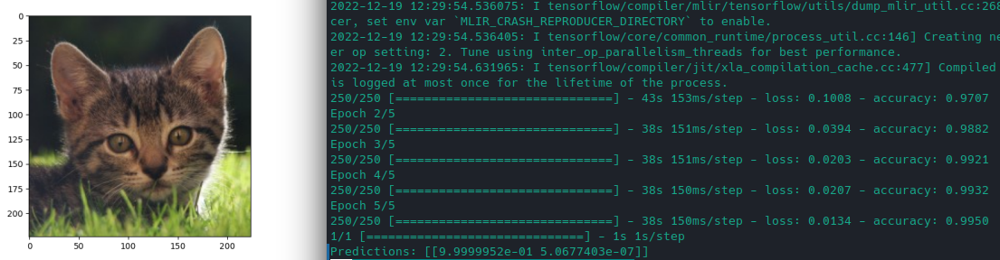

# Tensorflow 2 

## Transfer Learning

Make use of __Transfer Learning__ to copy&paste general feature detections from pre-trained models ([ResNet50](https://www.kaggle.com/datasets/keras/resnet50)) into your own projects.

The dataset used is [Cats and Dogs](https://www.kaggle.com/datasets/tongpython/cat-and-dog) from `kaggle.com`. And it will help us to train a set of dense layers on top of the ResNet50 basic feature detection layers to distinguish between photos of cats and dogs:

We are `99.999952%` sure that this is a cat :thumbsup: